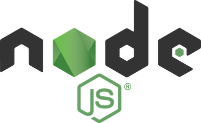

    <h1>ERP System</h1>

    

        
    

    <h2>Overview</h2>
    
This Enterprise Resource Planning (ERP) system is designed to streamline business operations by integrating various departments and functions into a single, comprehensive software solution. Our ERP system aims to enhance efficiency, facilitate data-driven decision making, and improve overall business performance.

    <h2>Features</h2>
    <ul>
        <li><strong>Financial Management:</strong> Accounting, budgeting, and financial reporting</li>
        <li><strong>Human Resources:</strong> Employee management, payroll, and recruitment</li>
        <li><strong>Supply Chain Management:</strong> Inventory, procurement, and logistics</li>
        <li><strong>Customer Relationship Management (CRM):</strong> Sales, marketing, and customer service</li>
        <li><strong>Business Intelligence:</strong> Real-time analytics and reporting</li>
        <li><strong>Project Management:</strong> Task allocation, progress tracking, and resource management</li>
    </ul>

    <h2>Technology Stack</h2>
    <ul>
        <li><strong>Backend:</strong> [Specify your backend technology, e.g., Node.js, Django, etc.]</li>
        <li><strong>Frontend:</strong> [Specify your frontend framework, e.g., React, Vue.js, etc.]</li>
        <li><strong>Database:</strong> [Specify your database, e.g., MongoDB etc.]</li>
        <li><strong>Authentication:</strong> [Specify your auth method, e.g., JWT, OAuth, etc.]</li>
    </ul>

    

        
        
    

    <h2>Installation</h2>
    <ol>
        <li>Clone the repository: 
            <code>git clone https://github.com/buckyxz/ERP-System</code></li>
        <li>Navigate to the project directory: 
            <code>cd erp-system</code></li>
        <li>Install backend dependencies: 
            <code>cd backend npm install</code></li>
        <li>Install frontend dependencies: 
            <code>cd ../frontend npm install</code></li>
        <li>Set up environment variables:
            <ul>
                <li>Create a .env file in the backend directory</li>
                <li>Add necessary environment variables (database connection, API keys, etc.)</li>
            </ul>
        </li>
        <li>Initialize the database: 
            <code>[Command to initialize your database]</code></li>
    </ol>

    <h2>Running the Application</h2>
    <ol>
        <li>Start the backend server: 
            <code>cd backend node server.js</code></li>
        <li>In a new terminal, start the frontend development server: 
            <code>cd frontend npm start</code></li>
        <li>Access the application at <a href="http://localhost:3000">http://localhost:3000</a> (or the port you've configured)</li>
    </ol>

    <h2>Contributing</h2>
    
We welcome contributions to the ERP System project. Please read our contributing guidelines (CONTRIBUTING.md) before submitting a pull request.

    <h2>License</h2>
    
This project is licensed under the <a href="LICENSE">[MIT License]</a>.

    <h2>Contact</h2>
    
If you have any questions or feedback, please contact us at <a href="mailto:bakidobur@gmail.com">bakidobur@gmail.com</a>.

    <h2>Acknowledgements</h2>
    <ul>
        <li>[List any libraries, frameworks, or tools you want to acknowledge]</li>
        <li>[Any individuals or organizations you want to thank]</li>
    </ul>
